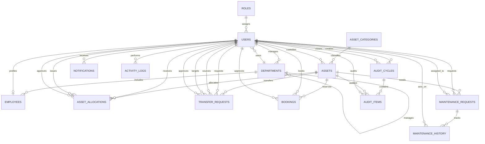

# AssetFlow ER Diagram

This diagram reflects the current normalized schema slice implemented in `models.py`.
It covers identity, organizational structure, asset lifecycle, allocation, transfer,
booking, maintenance, audit, notifications, and activity logging.

## Notes

- The model is intentionally normalized so workflow tables keep their own history instead of embedding state into `assets` or `users`.
- Indexes are added on commonly filtered fields such as `status`, `asset_tag`, `recipient_user_id`, and time-based workflow columns.
- The next natural step is adding migrations and seed/bootstrap routines so the schema can be created and initialized consistently across environments.
